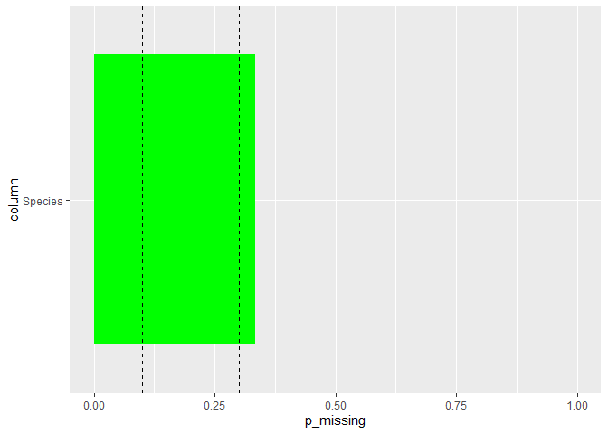

# explorebunny

The goal of explorebunny is to facilitate data exploration.

## Installation

You can install the development version of explorebunny from
[GitHub](https://github.com/) with:

``` r
# install.packages("devtools")
devtools::install_github("DanielBraddock/explorebunny")
#> Using GitHub PAT from the git credential store.
#> Skipping install of 'explorebunny' from a github remote, the SHA1 (b4d3cf21) has not changed since last install.
#>   Use `force = TRUE` to force installation
```

## Example

### Exploring missingness

``` r
library(explorebunny)
iris2 <- iris
iris2[iris2$Species == "setosa", "Species"] <- NA_character_
iris2 |> explore_na()
#> Rows: 150
```



Happy exploring!
